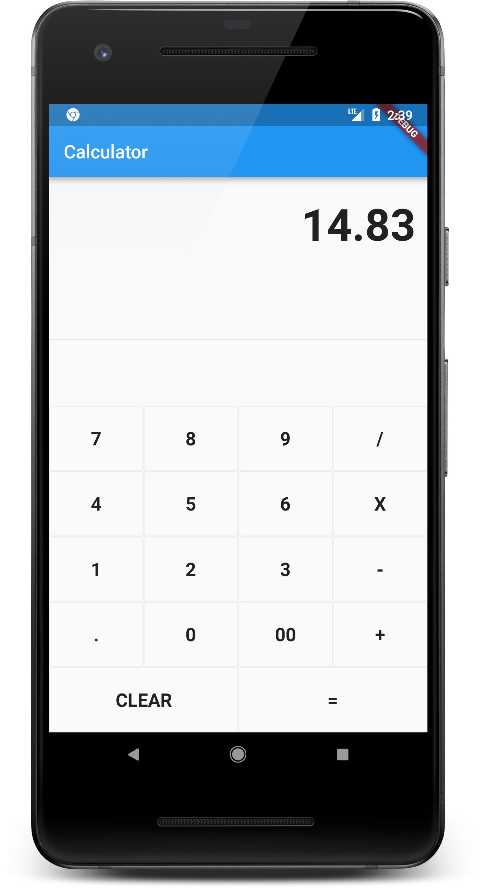

# Flutter Calculator App 🔢

A simple, lightweight, and efficient **Calculator** built with Flutter. This project demonstrates clean UI design and basic mathematical logic handling in mobile development.

⭐️ **Star the repository if you find it useful!**

---

## 📸 Preview

| Dark Mode | Operations | Results |
| :---: | :---: | :---: |
|  |  |  |

---

## Features ✨

- 📱 **Responsive Design:** Looks great on any screen size.
- ➗ **Standard Operations:** Addition, subtraction, multiplication, and division.
- 🎨 **Clean UI:** Minimalist design with high-readability fonts.
- ⚡ **Instant Results:** Real-time calculation logic.

---

## Tech Stack 🛠

- **Framework:** [Flutter](https://flutter.dev)
- **Language:** [Dart](https://dart.dev)

---

## Getting Started 🚀

Follow these steps to run the project locally:

### 1. Clone the repository
```bash
git clone [https://github.com/maratbeknyazov/calculator_app.git](https://github.com/maratbeknyazov/calculator_app.git)
cd calculator_app